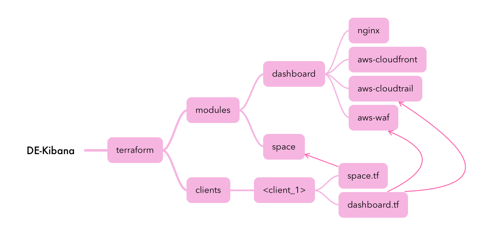

# Terraform ES Project

This a Terraform project that aims to automate the configuration of Kibana using infra as code (Terraform)

## Table of Contents

- [Installation](#installation)
- [Usage](#usage)
- [Tests](#tests)

## Folder Structure

The objective is to devise a module that generates predefined objects in Kibana, which will invoke the necessary modules tailored to each client's specific request and setup.




## Installation

Install Terraform version 2 or higher

Refer to installation guide https://developer.hashicorp.com/terraform/tutorials/aws-get-started/install-cli

## Usage

Use the following command

```bash
terraform init
terraform apply -var-file=values.tfvars
```
## Tests